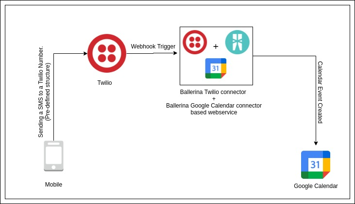

# Twilio to Google Calender - Create new calender events via SMS
<div style="text-align:center"></div>

## Integration Use Case
This integration template listens to the incoming sms (with a predefined template) and create an event in the Google Calender.

## Pre-requisites
- [Ballerina Distribution](https://ballerina.io/learn/getting-started/)
- A Text Editor or an IDE ([VSCode](https://marketplace.visualstudio.com/items?itemName=ballerina.ballerina), 
[IntelliJ IDEA](https://plugins.jetbrains.com/plugin/9520-ballerina)). 
- Google Cloud Platform Account
- Twilio Connector and Google Calender connector, which will be downloaded from Ballerina Central during the build process.

## Configuring the Integration Template
Create a Google Google Cloud Platform (GCP) account and log into the [developer console](https://console.cloud.google.com/).

- Setup an OAuth App and get client ID and client secret credentials
- Further obtain Access Token and Refresh Token, and Refresh Token URL 
- Create a Google sheet and get its ID and Sheet name.
- Insert set of Languages(to the fist column of the sheet) which we want to put forward in the survey to get user votes

Once you obtained all configurations, Replace "" in the `ballerina.conf` file with your data.

##### ballerina.conf
```
PORT = 

ACCESS_TOKEN=""
CLIENT_ID=""
CLIENT_SECRET=""
REFRESH_URL=""
REFRESH_TOKEN=""
SPREADSHEET_ID=""
SHEET_NAME=""

STATUS_CALLBACK_URL=""
AUTH_TOKEN=""

```

## Webhook Callback URL registration
- Use ngrok and obtain a proxy URL.
- Add it under the incoming message webhook URL under your twilio number in the [twilio dashboard]. 
